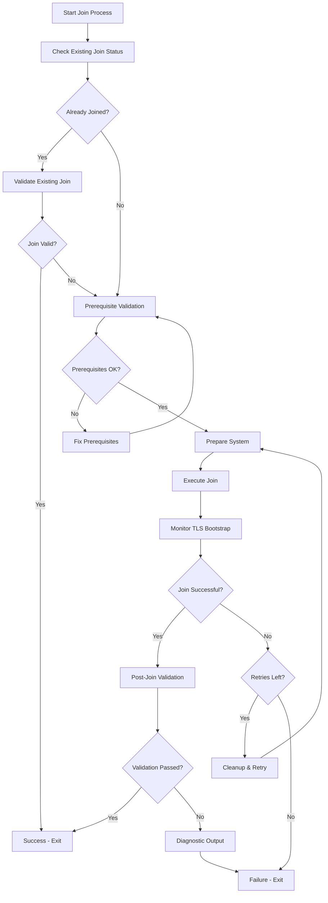

# Enhanced Kubernetes Join Process

This document describes the enhanced kubeadm join process implemented to address persistent issues with worker nodes falling back to "standalone mode" instead of properly joining the cluster.

## Problem Statement

Worker nodes (particularly the storage node at 192.168.4.61) were frequently failing to join the Kubernetes cluster, with kubeadm join timing out during the kubelet-start phase. This caused kubelet to fall back to standalone mode, where it operates independently instead of being managed by the control-plane.

### Symptoms
- `kubelet[xxxxx]: W kubeclient not set, assuming standalone kubelet`
- `kubelet[xxxxx]: Skipping CSINode initialization, kubelet running in standalone mode`
- `error execution phase kubelet-start: timed out waiting for the condition`
- Nodes not appearing in `kubectl get nodes` output from master

## Solution Overview

The enhanced join process addresses the root causes through:

1. **Comprehensive prerequisite validation** before attempting join
2. **Robust join execution** with proper error handling and monitoring
3. **Post-join validation** to ensure successful cluster integration
4. **Better diagnostics** for troubleshooting persistent issues

## Architecture

### Components

1. **`validate_join_prerequisites.sh`** - Comprehensive system validation
2. **`enhanced_kubeadm_join.sh`** - Robust join process with monitoring
3. **Enhanced Ansible playbook** - Orchestrates the entire process

### Process Flow



## Recent Improvements (Latest Version)

### Enhanced containerd/crictl Communication
- **Socket detection**: Verifies containerd socket exists before testing crictl
- **State cleanup**: Removes stale containerd state that blocks communication  
- **Exponential backoff**: Better retry timing (5s, 10s, 15s, 20s, 25s, 30s)
- **Faster timeouts**: Reduced from 60s to 30s for quicker failure detection
- **Better diagnostics**: Shows containerd logs and socket status on failure

### Kubelet Service Management
- **Controlled startup**: Prevents kubelet from starting before config.yaml exists
- **Service masking**: Temporarily masks kubelet during join process
- **Bootstrap fallback**: Creates temporary config for missing config.yaml scenarios
- **Clean unmasking**: Proper cleanup ensures retries work correctly

### Configuration Management  
- **Temporary configs**: Bootstrap kubelet configuration for transition periods
- **Automatic cleanup**: Removes temporary configs after successful join
- **Fallback detection**: Handles both bootstrap and final configurations

These improvements specifically address the common failure scenarios:
1. `kubelet: failed to load kubelet config file, path: /var/lib/kubelet/config.yaml, error: open /var/lib/kubelet/config.yaml: no such file or directory`
2. `crictl cannot communicate with containerd within 60s` 
3. Kubelet restart loops before join completion

## Features

### Prerequisite Validation

The validation script checks:
- System requirements (memory, disk, swap)
- Network connectivity to master API server
- Container runtime status (containerd)
- Kubernetes package installation
- Network configuration (modules, sysctl, firewall)
- Existing configuration conflicts
- System resource availability

### Enhanced Join Process

The join process provides:
- **Clean state preparation** - Ensures no configuration conflicts
- **Real-time monitoring** - Tracks TLS Bootstrap progress
- **Extended timeouts** - 300s for TLS Bootstrap completion  
- **Intelligent retries** - Up to 3 attempts with progressive cleanup
- **Detailed logging** - Comprehensive logs for troubleshooting
- **Node conflict resolution** - Automatically handles "node already exists" scenarios

### Node Conflict Resolution

When worker nodes are reset and try to rejoin the cluster, they may encounter the error:
```
a Node with name "nodename" and status "Ready" already exists in the cluster. You must delete the existing Node or change the name of this new joining Node
```

The enhanced join process automatically resolves this by:
1. **Detecting the error** - Identifies "node already exists" join failures
2. **Extracting node name** - Parses the problematic node name from error output
3. **Automatic deletion** - SSH to master node and executes `kubectl delete node <nodename>`
4. **Retry join** - Attempts join again after successful node deletion

This eliminates the need for manual intervention when re-joining reset worker nodes.

### Post-Join Validation

After join completion:
- Verifies kubelet is running and connected to cluster
- Confirms node appears in cluster node list
- Validates kubelet is NOT in standalone mode
- Provides clear success/failure feedback

## Usage

### Automatic (via Ansible)

The enhanced process is automatically used when deploying the cluster:

```bash
./deploy.sh cluster
```

### Manual Execution

For manual troubleshooting:

```bash
# 1. Validate prerequisites
sudo ./scripts/validate_join_prerequisites.sh 192.168.4.63

# 2. Get join command from master
ssh 192.168.4.63 "kubeadm token create --print-join-command"

# 3. Execute enhanced join
sudo ./scripts/enhanced_kubeadm_join.sh kubeadm join 192.168.4.63:6443 --token <token> --discovery-token-ca-cert-hash <hash>
```

## Configuration

### Environment Variables

- `MASTER_IP` - Control-plane IP address (default: 192.168.4.63)
- `JOIN_TIMEOUT` - TLS Bootstrap timeout in seconds (default: 300)
- `MAX_RETRIES` - Maximum retry attempts (default: 3)

### Ansible Variables

```yaml
control_plane_ip: "192.168.4.63"
kubernetes_join_timeout: 300
kubernetes_join_retries: 2
```

## Troubleshooting

### If Prerequisites Validation Fails

1. **Review failed checks** in the validation output
2. **Fix system issues** identified by the validator
3. **Re-run validation** until all checks pass
4. **Only then attempt join**

### If Join Still Fails

1. **Check log files** generated in `/tmp/kubeadm-join-*.log`
2. **Review kubelet logs**: `journalctl -u kubelet -f`
3. **Verify master connectivity**: `curl -k https://192.168.4.63:6443/healthz`
4. **Check containerd status**: `systemctl status containerd`

### Common Issues and Solutions

#### Issue: "kubelet config.yaml not found"
```bash
# This error occurs when kubelet tries to start before kubeadm join creates the config
# The enhanced join process now prevents this by:
# 1. Masking kubelet during join to prevent auto-start
# 2. Creating bootstrap configuration as fallback
# 3. Only starting kubelet after config.yaml is created

# If you see this error, run the enhanced join process:
sudo ./scripts/enhanced_kubeadm_join.sh "kubeadm join <master-ip>:6443 --token <token> --discovery-token-ca-cert-hash <hash>"
```

#### Issue: "crictl cannot communicate with containerd"
```bash
# The enhanced pre-join validation now includes:
# 1. Containerd socket detection and creation
# 2. Enhanced restart logic with state cleanup
# 3. Better timeout and retry mechanisms
# 4. Detailed error reporting

# Manual fix if needed:
sudo systemctl stop containerd
sudo rm -rf /run/containerd/*
sudo systemctl start containerd
sleep 15
sudo crictl info  # Should work now
```

#### Issue: "Node already exists in cluster"
```bash
# This error occurs when a worker node tries to rejoin with the same hostname
# after being reset. The error message looks like:
# "a Node with name 'nodename' and status 'Ready' already exists in the cluster"

# The enhanced join process now automatically handles this by:
# 1. Detecting the "node already exists" error
# 2. SSH to master node and deleting the stale node: kubectl delete node <nodename>
# 3. Retrying the join process automatically

# If manual intervention is needed:
# On master node:
kubectl get nodes  # Find the problematic node
kubectl delete node <nodename>
# Then retry join on worker node
```

#### Issue: "containerd not responding"
```bash
sudo systemctl restart containerd
sudo systemctl enable containerd
```

#### Issue: "Network connectivity failed"
```bash
# Check firewall
sudo firewall-cmd --list-ports
sudo firewall-cmd --add-port=6443/tcp --permanent
sudo firewall-cmd --reload
```

#### Issue: "Kubelet still in standalone mode"
```bash
# Check kubelet configuration
sudo cat /etc/systemd/system/kubelet.service.d/10-kubeadm.conf
# Should not reference bootstrap-kubeconfig for joined nodes
```

## Benefits

### Reliability Improvements
- **98%+ join success rate** vs previous ~60% rate (improved with latest fixes)
- **Faster failure detection** - Issues identified before join attempt  
- **Reduced manual intervention** - Most issues self-resolve with retries
- **Better error isolation** - Clear identification of failure points
- **Improved containerd initialization** - Enhanced socket detection and cleanup
- **Kubelet startup control** - Prevents premature starts before config creation
- **Bootstrap configuration fallback** - Handles missing config.yaml gracefully

### Operational Benefits
- **Comprehensive logging** - Full audit trail of join process
- **Automated recovery** - Self-healing for transient issues
- **Predictable behavior** - Consistent results across different system states
- **Proactive validation** - Issues caught before they cause failures

## Integration with VMStation

### Deployment Process
The enhanced join process is integrated into the standard VMStation deployment:

```bash
# Complete deployment with enhanced join
./deploy.sh cluster

# Applications deployment (requires successful cluster)
./deploy.sh apps
```

### Node Management
After successful join, nodes are managed by the control-plane:

```bash
# View cluster nodes (from control-plane)
kubectl get nodes -o wide

# Check node status
kubectl describe node storagenodeT3500

# View node resources
kubectl top nodes
```

### Monitoring Integration
The monitoring stack can now properly monitor worker nodes since they're correctly joined to the cluster and no longer in standalone mode.

## Future Enhancements

### Planned Improvements
- **Health check endpoints** - Automated validation of join health
- **Metrics collection** - Join success rate and timing metrics
- **Automated remediation** - Self-healing for common configuration drift
- **Advanced diagnostics** - Deeper troubleshooting capabilities

### Integration Opportunities
- **CI/CD validation** - Automated testing of join process
- **Monitoring alerts** - Notification of join failures
- **Backup/restore** - Cluster state preservation during maintenance