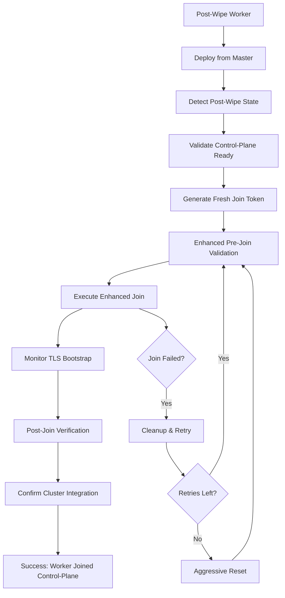

# Post-Wipe Worker Join Process

## Overview

This document describes the enhanced worker join process specifically designed to handle workers that have been reset using `aggressive_worker_wipe_preserve_storage.sh` or similar aggressive cleanup procedures.

## Problem Statement

After aggressively wiping worker nodes to preserve storage while removing all Kubernetes state, the workers need to be cleanly rejoined to the control-plane cluster. The enhanced join process ensures:

1. **Clean State Detection**: Automatically detects post-wipe worker state
2. **Control-Plane Validation**: Ensures control-plane is ready before attempting joins
3. **Fresh Token Generation**: Creates new join tokens with appropriate TTL
4. **Enhanced Validation**: Comprehensive pre and post-join validation
5. **Standalone Prevention**: Ensures workers join control-plane (NOT standalone mode)

## Usage

### Automatic Deployment (Recommended)

After wiping workers with `aggressive_worker_wipe_preserve_storage.sh`, deploy from the master node:

```bash
# From the master node (control-plane)
./deploy.sh cluster
```

Or for a complete deployment:

```bash
# From the master node (control-plane)  
./deploy.sh full
```

### Manual Join Process

For troubleshooting or manual worker joins:

```bash
# 1. On master node - generate join command
./generate_join_command.sh

# 2. On worker node - execute enhanced join
sudo ./scripts/enhanced_kubeadm_join.sh "kubeadm join 192.168.4.63:6443 --token <token> --discovery-token-ca-cert-hash <hash>"
```

## Enhanced Features for Post-Wipe Workers

### Automatic Post-Wipe Detection

The enhanced join process automatically detects when a worker has been aggressively wiped by checking:

- Absence of `/etc/kubernetes/kubelet.conf`
- Missing cluster artifacts (`/etc/kubernetes/pki/ca.crt`)
- Clean kubelet state (`/var/lib/kubelet/config.yaml`)
- Empty CNI configuration
- Clean directory states

Workers with >75% clean indicators are classified as "post-wipe" workers.

### Control-Plane Readiness Validation

Before attempting worker joins, the process validates:

- API server accessibility on port 6443
- API health endpoint response
- RBAC configuration completeness
- Cluster-info configmap accessibility

### Enhanced Join Token Management

For post-wipe workers:

- Generates fresh tokens with 2-hour TTL
- Cleans up old tokens (maintains max 5)
- Validates token contains correct control-plane IP
- Includes timestamp and metadata in join scripts

### Comprehensive Pre-Join Validation

Before join execution:

- Validates containerd service status
- Ensures CRI interface functionality
- Tests network connectivity to control-plane
- Verifies system readiness for kubelet startup

### Post-Join Verification

After successful join:

- Confirms kubelet is NOT in standalone mode
- Validates cluster connectivity
- Verifies kubelet.conf points to correct control-plane
- Confirms node registration in cluster
- Checks node Ready status from control-plane

## Process Flow



## Configuration

### Environment Variables

- `MASTER_IP` - Control-plane IP address (default: 192.168.4.63)
- `JOIN_TIMEOUT` - TLS Bootstrap timeout in seconds (default: 120 for post-wipe)
- `MAX_RETRIES` - Maximum retry attempts (default: 3 for post-wipe)
- `WORKER_POST_WIPE` - Automatically set when post-wipe state detected

### Ansible Variables

```yaml
control_plane_ip: "192.168.4.63"
kubernetes_join_timeout: 120
kubernetes_join_retries: 3
```

## Expected Outcomes

### Successful Post-Wipe Join

```
=== Enhanced Join for Post-Wipe Worker ===
✓ Post-wipe state detected (85% clean)
✓ Control-plane ready for worker joins
✓ Fresh join token generated (2h TTL)
✓ Pre-join validation passed
✓ Enhanced join process completed
✓ kubelet connected to control-plane (NOT standalone)
✓ Node registered in cluster
✓ Post-wipe worker join COMPLETED
```

### Cluster Integration Verification

```bash
# From control-plane, verify worker integration
kubectl get nodes -o wide

# Should show all workers as Ready, with correct internal IPs
# Example output:
NAME               STATUS   ROLES           AGE   VERSION   INTERNAL-IP    EXTERNAL-IP   OS-IMAGE             KERNEL-VERSION
control-plane      Ready    control-plane   1h    v1.29.15   192.168.4.63   <none>        Ubuntu 20.04.6 LTS   5.4.0-150-generic
storage-worker     Ready    <none>          5m    v1.29.15  192.168.4.61   <none>        Ubuntu 20.04.6 LTS   5.4.0-150-generic
compute-worker     Ready    <none>          5m    v1.29.15  192.168.4.62   <none>        Ubuntu 20.04.6 LTS   5.4.0-150-generic
```

## Troubleshooting

### Join Failures After Wipe

1. **Verify control-plane status**:
   ```bash
   kubectl get nodes
   kubectl get pods -n kube-system
   ```

2. **Check worker connectivity**:
   ```bash
   # From worker
   telnet 192.168.4.63 6443
   ```

3. **Validate containerd state**:
   ```bash
   systemctl status containerd
   crictl info
   ```

4. **Review join logs**:
   ```bash
   # Check enhanced join logs
   ls -la /tmp/kubeadm-join-*.log
   tail -f /tmp/kubeadm-join-*.log
   ```

### Common Issues

| Issue | Cause | Solution |
|-------|-------|----------|
| "Post-wipe state not detected" | Residual Kubernetes files | Run additional cleanup: `sudo kubeadm reset --force` |
| "Control-plane not ready" | API server issues | Restart control-plane services |
| "Containerd filesystem error" | Corrupted containerd state | Run: `sudo systemctl restart containerd` |
| "kubelet in standalone mode" | Join failed silently | Check network connectivity and tokens |
| "Node name conflicts during join" | Multiple workers using same node name | Fixed in v2.1+ - join commands now use worker hostnames |
| "Workers fail to appear in kubectl get nodes" | Node name mismatch in join process | Verify worker joins with correct hostname (ansible_hostname) |

### Manual Recovery

If automatic post-wipe join fails:

```bash
# 1. Complete manual reset on worker
sudo kubeadm reset --force
sudo systemctl stop kubelet containerd
sudo rm -rf /etc/kubernetes/* /var/lib/kubelet/* /etc/cni/net.d/*
sudo systemctl start containerd
sleep 10

# 2. Generate fresh token on master
ssh master-node "kubeadm token create --print-join-command"

# 3. Manual enhanced join on worker
sudo ./scripts/enhanced_kubeadm_join.sh "kubeadm join ..."
```

## Integration with VMStation

The post-wipe worker join process is fully integrated with VMStation's deployment system:

- **`deploy.sh cluster`** - Uses enhanced join for all workers
- **`deploy.sh full`** - Includes enhanced join + application deployment
- **Ansible playbooks** - Automatically detect and handle post-wipe workers
- **Monitoring integration** - Workers properly integrated with monitoring stack

## Security Considerations

- Join tokens have 2-hour TTL for security
- TLS certificates managed by control-plane
- RBAC properly configured for cluster access
- No standalone mode - all workers managed by control-plane
- Old tokens automatically cleaned up

## Performance Optimizations

For post-wipe workers:
- Extended timeout values for containerd initialization
- Aggressive reset escalation for stubborn nodes
- Parallel worker joins when possible
- Enhanced logging for faster troubleshooting